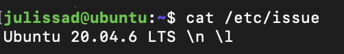
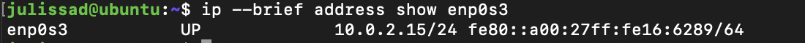
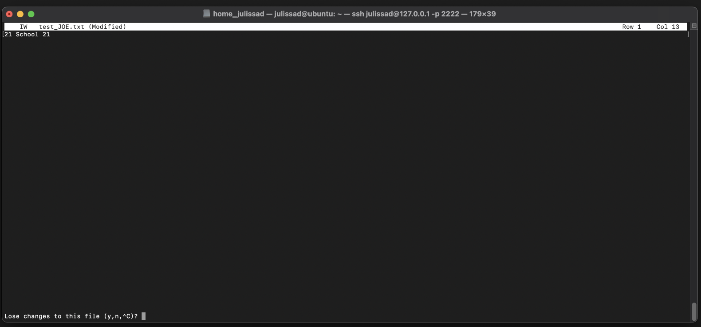
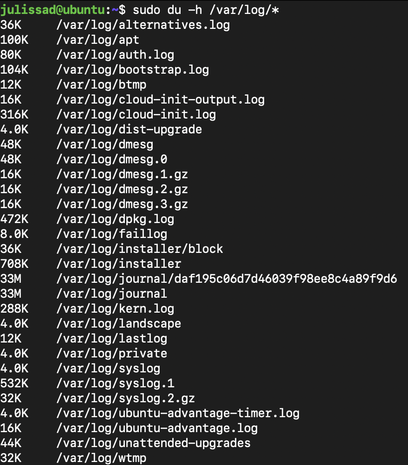

# Part 1. Установка ОС

## 1. Установить Ubuntu 20.04 Server LTS без графического интерфейса. (Используем программу для виртуализации - VirtualBox)

 

## 2. Узнайте версию Ubuntu, выполнив команду cat /etc/issue и вставьте скриншот с выводом команды.

   

# Part 2. Создание пользователя

## 1. Создать пользователя, отличного от пользователя, который создавался при установке. Пользователь должен быть добавлен в группу adm.

## 2. Новый пользователь должен быть в выводе команды cat /etc/passwd  

## 3. Вставьте скриншот с выводом команды.

  

# Part 3. Настройка сети ОС

## 1. Задать название машины вида user-1

   

## 2. Установить временную зону, соответствующую вашему текущему местоположению.

   

## 3. Вывести названия сетевых интерфейсов с помощью консольной команды.

   

## 4. В отчёте дать объяснение наличию интерфейса lo.

- lo (loopback device) – виртуальный интерфейс, присутствующий по умолчанию в любом Linux. Он используется для отладки сетевых программ и запуска серверных приложений на локальной машине.
     

## 5. Используя консольную команду получить ip адрес устройства, на котором вы работаете, от DHCP сервера.

   

## 6. В отчёте дать расшифровку DHCP.

- DHCP (англ. Dynamic Host Configuration Protocol — протокол динамической настройки узла) — сетевой протокол, позволяющий сетевым устройствам автоматически получать IP-адрес и другие параметры, необходимые для работы в сети TCP/IP. Данный протокол работает по модели «клиент-сервер». Для автоматической конфигурации компьютер-клиент на этапе конфигурации сетевого устройства обращается к так называемому серверу DHCP и получает от него нужные параметры. Сетевой администратор может задать диапазон адресов, распределяемых сервером среди компьютеров. Это позволяет избежать ручной настройки компьютеров сети и уменьшает количество ошибок. Протокол DHCP используется в большинстве сетей TCP/IP.
     

## 7. Определить и вывести на экран внешний ip-адрес шлюза (ip)

   

## внутренний IP-адрес шлюза, он же ip-адрес по умолчанию (gw)

   

## 8. Задать статичные (заданные вручную, а не полученные от DHCP сервера) настройки ip, gw, dns (использовать публичный DNS серверы, например 1.1.1.1 или 8.8.8.8).

 

## Переходим в директорию «netplan» и изменяем через «sudo vim 00-installer-config.yaml» файл «00-installer-config.yaml»

## Было:

   

## Стало:


   

## 9. Перезагрузил виртуальную машину.

## 10. Успешно пропинговать удаленные хосты 1.1.1.1 и ya.ru и вставить в отчёт скрин с выводом команды. В выводе команды должна быть фраза "0% packet loss".

   

   

# Part 4. Обновление ОС

## 1. Обновить системные пакеты до последней на момент выполнения задания версии.

## 2. После обновления системных пакетов, если ввести команду обновления повторно, должно появится сообщение, что обновления отсутствуют.

## 3. Вставить скриншот с этим сообщением в отчёт.


   

# Part 5. Использование команды sudo

## 1. Разрешить пользователю, созданному в Part 2, выполнять команду sudo.


   

## Проверяем:


   

## 2. В отчёте объяснить истинное назначение команды sudo (про то, что это слово - "волшебное", писать не стоит).

- sudo предоставляет возможность пользователям выполнять команды от имени суперпользователя root, либо других пользователей.
    

## 3. Поменять hostname ОС от имени пользователя, созданного в пункте Part 2 (используя sudo).

   

## 4. Вставить скрин с изменённым hostname в отчёт.

   

# Part 6. Установка и настройка службы времени

## 1. Настроить службу автоматической синхронизации времени.

   

## 2. Вывести время, часового пояса, в котором вы сейчас находитесь.

   

## 3. Вывод следующей команды должен содержать NTPSynchronized=yes: timedatectl show

## 4. Вставить скрины с корректным временем и выводом команды в отчёт.

   

# Part 7. Установка и использование текстовых редакторов

## 1. Установить текстовые редакторы VIM (+ любые два по желанию NANO, MCEDIT, JOE и т.д.)

## VIM:

   

## NANO

   

## JOE

   

## 2. Используя каждый из трех выбранных редакторов, создайте файл test_X.txt, где X -- название редактора, в котором создан файл. Напишите в нём свой никнейм, закройте файл с сохранением изменений.

## 3. В отчёт вставьте скриншоты:

## - Из каждого редактора с содержимым файла перед закрытием.

## - В отчёте укажите, что сделали для выхода с сохранением изменений.

  

## VIM:

## Создаем текстовый файл:

  

## Для внесения изменений необходимо перейти в режим редактирования (INSERT), для этого необходимо нажать i. После внесения изменений переходим в обычный режим с помощью клавиши Esc. Чтобы выйти и сохранить изменения, переходим в командный режим с помощью : и после этого вводим wq.

   

## NANO:

## Создаем текстовый файл:

  

## Чтобы выйти и сохранить изменения, нажимаем Ctrl+X, в открывшемся диалоговом окне Save modified buffer?, отвечаем Y. После этого можно изменить название файла. Чтобы оставить прежнее название, просто нажимаем Enter.

  

## JOE:

## Создаем текстовый файл:


  

## Чтобы выйти и сохранить изменения, нажимаем Ctrl+K, после этого X, чтобы сохранить.

   

## 3. Используя каждый из трех выбранных редакторов, откройте файл на редактирование, отредактируйте файл, заменив никнейм на строку "21 School 21", закройте файл без сохранения изменений.

## - В отчёт вставьте скриншоты:

## - Из каждого редактора с содержимым файла после редактирования.

## - В отчёте укажите, что сделали для выхода без сохранения изменений.

  

## VIM:

## Откроем файл для редактирования и выйдем без сохранения (Esc, затем :q!).


  

## NANO:

## Откроем файл для редактирования и выйдем без сохранения: нажимаем Ctrl+X, в открывшемся диалоговом окне Save modified buffer?, отвечаем N.

  

## JOE:

## Откроем файл для редактирования и выйдем без сохранения: нажимаем Ctrl+C, он спрашивает : «Lose changes to this file (y,n,^C)? »после этого Y.

  

## 4. Используя каждый из трех выбранных редакторов, отредактируйте файл ещё раз (по аналогии с предыдущим пунктом), а затем освойте функции поиска по содержимому файла (слово) и замены слова на любое другое

  

## 4.1. Из каждого редактора с результатами поиска слова:

## VIM:

## Открываем текстовый файл, редактируем файл, для поиска нажимаем «/» и пишем слово которое ищем.

  

## NANO:

## Открываем текстовый файл, редактируем файл, для поиска нажимаем «Ctrl+W» и пишем слово которое ищем.

  

## JOE:

## Открываем текстовый файл, редактируем файл, для поиска нажимаем «Ctrl+K» потом «Shift+F» и пишем слово которе ищем:

  

## Далее нажимаем «Enter»:

  

## После чего он укажет курсором где нашел слово:

   

## 4.2. Из каждого редактора с командами, введёнными для замены слова на другое.

## VIM:

## Для замены слова «:%s/слово, которое хотим поменять/слово, на которое будем менять» и нажимаем клавишу «Enter».

## - «%» символ указывает диапазон от первой до последней строки файла:

  

## NANO:

## Для замены нажимаем  «Ctrl+\», вводим строку, которую необходимо искать и нажимаем клавишу «Enter». Затем вводим строку, на которую хотим произвести замену и нажмите «Enter».

 

## После этого появится предложение по замене первого вхождения строки. Можно нажать: A — Выполнить автоматическую замену всех вхождений строки. Y — Выполнить замену данной найденной строки (после этого вы переместитесь к следующему в хождению искомой строки). N — Отменить замену данной строки (после этого вы переместитесь к следующему в хождению искомой строки). Ctrl+C — Прервать поиск.

  

## JOE:

## Для замены нажимаем  «Ctrl+K»,далее «Shift+F» вводим строку, которую необходимо искать и нажимаем клавишу «Enter».

  

## Далее наживаем «Shift + R» и нажимаем клавишу «Enter». :

  

## После чего пишем слово на которое хотим поменять и нажимаем клавишу «Enter». :

  

## и нажимаем клавишу «Enter»:

   

# Part 8. Установка и базовая настройка сервиса SSHD

## 1. Установить службу SSHd.

## 1.1. Обновляем список пакетов:

  

## 1.2. Установим сетевой протокол SSH:

  

## 1.3. Устанавливаем пакет openssh-server, который содержит SSHD:

  

## 1.4. Проверяем статус, который говорит о том, что SSHD установлен:

  

## 2. Добавить автостарт службы при загрузке системы.

## 2.1. Для включения автостарта службы SSHd:

  

## 2.2. Проверить статус автостарта

  

## 3. Перенастроить службу SSHd на порт 2022.

## 3.1. Открываем через VIM:

  

## 4. Используя команду ps, показать наличие процесса sshd. Для этого к команде нужно подобрать ключи.

  

## 4.1. В отчёте объяснить значение команды и каждого ключа в ней.

## - Команда ps выводит список текущих процессов на вашем сервере в виде таблицы, с которой можно удобно работать: сортировать, изменять количество колонок и прочие. У утилиты ps множество настроек, с помощью которых можно тонко настраивать вывод команды

 

## - Вот список опций выбора процессов для отображения:

## 1. -A, -e, (a) - выбрать все процессы;

## 2. -a - выбрать все процессы, кроме фоновых;

## 3. -d, (g) - выбрать все процессы, даже фоновые, кроме процессов сессий;

## 4. -N - выбрать все процессы кроме указанных;

## 5. -С - выбирать процессы по имени команды;

## 6. -G - выбрать процессы по ID группы;

## 7. -p, (p) - выбрать процессы PID;

## 8. --ppid - выбрать процессы по PID родительского процесса;

## 9. -s - выбрать процессы по ID сессии;

## 10. -t, (t) - выбрать процессы по tty;

## 11. -u, (U) - выбрать процессы пользователя.

 

## 4.2. Перезагрузить систему.

  

## 5. Вывод команды netstat -tan должен содержать tcp 0 0 0.0.0.0:2022 0.0.0.0:\* LISTEN (если команды netstat нет, то ее нужно установить)

  

## 5.1. Скрин с выводом команды вставить в отчёт.

  

## 5.2. В отчёте объяснить значение ключей -tan, значение каждого столбца вывода, значение 0.0.0.0.

## -t - показывает активные TCP-соединения.

## -a - получение списка всех сокетов, использующих TCP-соединение.

## -n - отображает имя хоста, порт или пользователя в числовом формате.

 

## Proto - имя протокола (TCP или UDP).

## Recv-Q - количество полученных пакетов в очереди.

## Send-Q - количество отправленных пакетов в очереди.

## Local Address - IP-адрес локального компьютера и номер используемого порта.

## Foreign Address - IP-адрес и номер порта удаленного компьютера, подключенного к данному сокету.

## State - указание состояния подключения TCP.

## 0.0.0.0 - IP-адрес на локальной машине.

   

# Part 9. Установка и использование утилит top, htop

## 1. Установить и запустить утилиты top.

  

## 2. По выводу команды top определить и написать в отчёте:

## uptime - время непрерывной работы 25 min.

## количество авторизованных пользователей - 2 user.

## load average - общая загрузка системы 0.82, 0.21, 0.07.

## Tasks(total) - общее количество процессов 98.

## %Cpu(s) - загрузка CPU:

- 0.0 us: нет использования ЦП времени выполнения пользовательских процессов.

- 0.3 sy: нет использования ЦП времени выполнения системных процессов ядра.

- 0.0 ni: нет использования ЦП времени выполнения процессов с приоритетом (nice).

- 99.7 id: 99.7% времени бездействия ЦП (не загружен).

- 0.0 wa: нет ожидания ввода-вывода ЦП.

- 0.0 hi: нет времени, затраченного на обработку аппаратных прерываний.

- 0.0 si: нет времени, затраченного на обработку программных прерываний.

- 0.0 st: нет времени, украденного гипервизором виртуальной машиной.

## MiB Mem - информация об использовании физической оперативной памяти:

- 1971.4 total - общее количество памяти.
- 1031.4 free - количество свободной памяти.
- 164.8 used - количество используемой памяти.
- 775.2 buff/cache - количество памяти в кэше буферов.

## MiB Swap - информация об использовании раздела подкачки:

- 1483.0 total.
- 1483.0 free.
- 0.0 used.
- 1656.7 avail Mem - это оценка физической памяти, доступной для запуска новых приложений без подкачки.

## pid процесса, занимающий больше всего памяти - 1.

## pid процесса, занимающий больше всего процессорного времени - 10.

  

## 3. В отчёт вставить скрин с выводом команды htop:

  

## 4. Отсортированному по PID, PERCENT_CPU, PERCENT_MEM, TIME

- Чтобы отсортировать необходимо нажать "F6" и выбрать необходимые подпункты.
  
    

## PID:

  

## PERCENT_CPU:

  

## PERCENT_MEM:

  

## TIME:

  

## 5. Отфильтрованному для процесса sshd

- Нажимаем "F4" пишем "sshd" нажимаем "Enter"
  
    

## 6. С процессом syslog, найденным, используя поиск

- Нажимаем "F3" пишем "syslog" нажимаем "Enter"
  
    

## 7. С добавленным выводом hostname, clock и uptime

- Нажимаем "F2" переходим в "Available meters" выбираем нужные выводы и нажимаем "Enter"
  
    

# Part 10. Использование утилиты fdisk

## 1. Запустить команду fdisk -l.

  

## 2. В отчёте написать название жесткого диска, его размер и количество секторов, а также размер swap.

1. Название жесткого диска : VBOX HARDDISK

2. Размер : 10 GiB

3. Количество секторов: 20971520 sectors

4. Размер swap:

  

# Part 11. Использование утилиты df

## 1. Запустить команду df.

  

## 1.1. В отчёте написать для корневого раздела (/):

1. Размер раздела: 8408452 КБ.

2. Размер занятого пространства: 4231788 КБ.

3. Размер свободного пространства: 3727948 КБ.

4. Процент использования: 54%

  

## 2. Запустить команду df -Th.

  

## 2.1. В отчёте написать для корневого раздела (/):

1. Размер раздела: 8.1G

2. Размер занятого пространства: 4.1G

3. Размер свободного пространства: 3.6G

4. Процент использования: 54%

5. Тип файловой системы для раздела: ext4

  

# Part 12. Использование утилиты du

## 1. Запустить команду du.

  

## 2. Вывести размер папок /home, /var, /var/log (в байтах, в человекочитаемом виде)

  

## 3. Вывести размер всего содержимого в /var/log (не общее, а каждого вложенного элемента, используя \*)

   

# Part 13. Установка и использование утилиты ncdu

## 1. Установить утилиту ncdu.

  

## 2. Вывести размер папок /home, /var, /var/log.

 

  

 

  

 

   

# Part 14. Работа с системными журналами

## 1. Открыть для просмотра:

1. /var/log/dmesg
   
     

2. /var/log/syslog
   
     

3. /var/log/auth.log
   
     

## 2. Написать в отчёте время последней успешной авторизации, имя пользователя и метод входа в систему.

1. время последней успешной авторизации: Jul 18 06:56:58
2. имя пользователя: julissad
3. метод входа в систему: password

## 3. Перезапустить службу SSHd и вставить в отчёт скрин с сообщением о рестарте службы (искать в логах).

 

   

# Part 15. Использование планировщика заданий CRON

## 1. Используя планировщик заданий, запустите команду uptime через каждые 2 минуты.

### 1.1. Пишем команду sudo crontab -e и выбираем редактор через который будем делать изменения

 

## 1.2. Добавляем "_/2 _ \* \* \* uptime"

  

## 2. Найти в системных журналах строчки (минимум две в заданном временном диапазоне) о выполнении.

  

## 3. Вывести на экран список текущих заданий для CRON и вставить в отчёт скрины со строчками о выполнении и списком текущих задач.

  

## 4. Удалите все задания из планировщика заданий и в отчёт вставьте скрин со списком текущих заданий для CRON.

  
